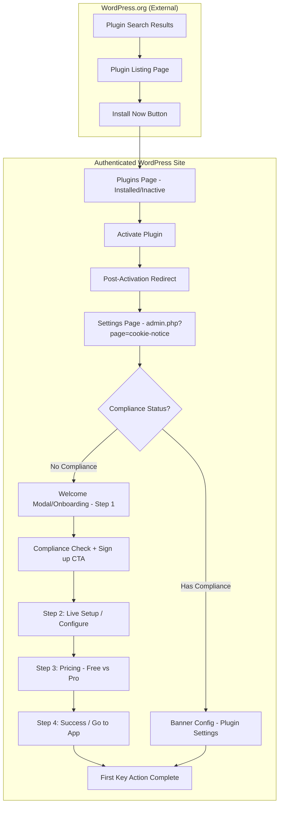
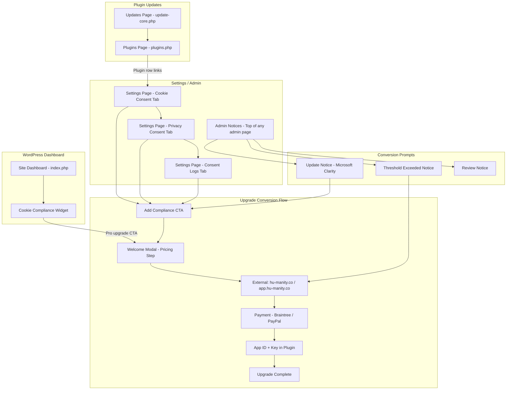

# Cookie Notice Plugin — User Journey Audit & Capability Mapping

**Objective:** Map end-to-end user experience for new and existing users, documenting what we **can** and **cannot** do at each touchpoint from a WordPress compliance perspective.

**Client's Goal (Context for Future Sessions):** Convert more customers from free to paid through more aggressive advertisements in WordPress while staying within WordPress.org rules and standards.

---

## Table of Contents

1. [New User Journey](#1-new-user-journey)
2. [Existing User Journey](#2-existing-user-journey)
3. [Capability Matrices](#3-capability-matrices)
4. [Summary & Recommendations](#4-summary--recommendations)
5. [Net New Recommendations (Client Discussion)](#5-net-new-recommendations-client-discussion)

---

## 1. New User Journey

**Starting Point:** WordPress.org plugin search results  
**Ending Point:** User completes first key action (successfully configures cookie banner)

### 1.1 New User Journey Flow Diagram

### 1.2 New User Touchpoints (Sequential)

| # | Touchpoint | Description |
|---|------------|-------------|
| 1 | **WordPress.org Search** | User searches for "cookie" / "GDPR" / "consent" |
| 2 | **Plugin Listing Page** | Title, description, screenshots, tags, install count |
| 3 | **Install & Activate** | Via WordPress admin Add Plugins → Search or direct install |
| 4 | **Plugins List** | Row shows Settings + Free Upgrade links (when no compliance) |
| 5 | **Settings Page (First Visit)** | Privacy menu → Cookie Consent tab; "Add Compliance features" CTA |
| 6 | **Welcome Modal** | Triggers on settings page when `?welcome=1` or transient set |
| 7 | **Onboarding Step 1** | Compliance check + "Sign up to Cookie Compliance" / "Skip for now" |
| 8 | **Onboarding Step 2** | Live setup iframe preview |
| 9 | **Onboarding Step 3** | Pricing selection: Basic (Free) vs Professional |
| 10 | **Onboarding Step 4** | Success → link to external Cookie Compliance app |
| 11 | **Plugin-Only Config** | If skipped: configure message, colors, position, accept/refuse text |
| 12 | **First Banner Live** | User saves settings; banner appears on frontend |

---

## 2. Existing User Journey

**Starting Point:** WordPress dashboard (user already has plugin installed)  
**Ending Point:** Completion of upgrade conversion flow (free → paid)

### 2.1 Existing User Journey Flow Diagram

### 2.2 Existing User Touchpoints

| # | Touchpoint | When It Appears |
|---|------------|-----------------|
| 1 | **Dashboard Widget** | Main dashboard when Compliance is active; shows usage chart, "Log in & Configure" |
| 2 | **Plugins Page** | Settings link; "Free Upgrade" link (when no compliance) |
| 3 | **Settings - Cookie Consent** | CTA: "Add Compliance features" or status + external config link |
| 4 | **Settings - Privacy Consent** | Same CTA when inactive |
| 5 | **Settings - Consent Logs** | Upgrade CTA when inactive (locked features) |
| 6 | **Admin Notices** | Site-wide: Update notice, threshold warning, review notice |
| 7 | **Welcome Modal** | When visiting settings with `?welcome=1` (no compliance) |
| 8 | **Deactivation Modal** | When clicking Deactivate on plugins.php |
| 9 | **External App** | hu-manity.co / app.hu-manity.co for signup, config, payment |
| 10 | **Site Health** | Site Status tests for cookie compliance |

---

## 3. Capability Matrices

### 3.1 Matrix Legend

- **PROPERTY:** Where the touchpoint occurs
- **PAGE:** Specific screen/URL
- **COMPONENT:** UI element type
- **WHAT WE CAN DO:** Allowed actions at this touchpoint (high-level)
- **WHAT WE CAN'T DO:** Prohibited actions (per WordPress.org guidelines)

---

### 3.2 WordPress.org (External — Not Plugin-Controlled)

| PROPERTY | PAGE | COMPONENT | WHAT WE CAN DO | WHAT WE CAN'T DO |
|----------|------|-----------|----------------|------------------|
| WordPress.org | Plugin search results | Search result card | Optimize name, short description, tags (≤5), install count | Keyword stuffing, competitor tags, spam |
| WordPress.org | Plugin listing page | Full readme, screenshots, FAQ, changelog | Describe free + paid features; link to cookie-compliance.co; disclose affiliate links | Trialware messaging; imply payment unlocks included features; guarantee legal compliance |
| WordPress.org | Install flow | Install / Update buttons | Standard install/update | N/A (WordPress.org controlled) |

---

### 3.3 Plugins Page (plugins.php)

| PROPERTY | PAGE | COMPONENT | WHAT WE CAN DO | WHAT WE CAN'T DO |
|----------|------|-----------|----------------|------------------|
| Authenticated WP | plugins.php | Plugin row action links | Add "Settings" link; add "Free Upgrade" link (when no compliance); modify deactivate link to show survey modal | Add more than 2–3 links that feel spammy; hijack entire row |
| Authenticated WP | plugins.php | Deactivation modal | Show optional survey before deactivate; send feedback to hu-manity.co | Require survey to deactivate; track without consent; make modal undismissible |

---

### 3.4 WordPress Dashboard (index.php)

| PROPERTY | PAGE | COMPONENT | WHAT WE CAN DO | WHAT WE CAN'T DO |
|----------|------|-----------|----------------|------------------|
| Authenticated WP | index.php | Dashboard widget | Show Cookie Compliance analytics (when active); "Log in & Configure" link; usage chart | Non-dismissible promo banners; excessive upgrade nags; third-party ad tracking |
| Authenticated WP | index.php | Admin notices | N/A (not used here currently) | Site-wide non-dismissible upgrade ads |

---

### 3.5 Admin Notices (Site-Wide)

| PROPERTY | PAGE | COMPONENT | WHAT WE CAN DO | WHAT WE CAN'T DO |
|----------|------|-----------|----------------|------------------|
| Authenticated WP | Any admin page | admin_notices / network_admin_notices | Contextual notices (update, threshold, review); CTA buttons to settings or external app; **must be dismissible** | Constant nags; non-dismissible notices; overwhelm dashboard; track referrals via ads |
| Authenticated WP | Any admin page | Notice content | Link to "Add Compliance" / "Upgrade to Pro"; explain value (e.g., Microsoft Clarity, threshold) | Imply users must pay for *included* plugin features; guarantee legal compliance |

---

### 3.6 Plugin Settings Page (admin.php?page=cookie-notice)

| PROPERTY | PAGE | COMPONENT | WHAT WE CAN DO | WHAT WE CAN'T DO |
|----------|------|-----------|----------------|------------------|
| Authenticated WP | admin.php?page=cookie-notice | Full settings page | Full control: tabs, forms, CTAs, upgrade prompts, status indicators | Hijack page to only show ads; hide core settings |
| Authenticated WP | admin.php?page=cookie-notice | Hero CTA / Empty states | "Add Compliance features" button; upgrade prompts when features locked (e.g., Consent Logs) | Lock *plugin* functionality behind payment (trialware); imply plugin is useless without upgrade |
| Authenticated WP | admin.php?page=cookie-notice | Welcome modal | Multi-step onboarding; compliance check; pricing (Free vs Pro); signup flow | Auto-show on every page load; make undismissible; obscure "Skip" option |
| Authenticated WP | admin.php?page=cookie-notice | Inline upsell | Links to external app; contextual "Upgrade" next to Pro-only options | Third-party ad tracking; misleading claims |

---

### 3.7 Consent Logs / Privacy Consent Tabs (Locked States)

| PROPERTY | PAGE | COMPONENT | WHAT WE CAN DO | WHAT WE CAN'T DO |
|----------|------|-----------|----------------|------------------|
| Authenticated WP | cookie-notice&tab=consent-logs | Full-page upgrade CTA | Show benefits (collect logs, export proof, legal confidence); "Upgrade to Cookie Compliance" button | Disable plugin that *works* without Compliance; trialware |
| Authenticated WP | cookie-notice&tab=privacy-consent | Full-page upgrade CTA | Same as above | Same as above |

---

### 3.8 Site Health (Tools → Site Health)

| PROPERTY | PAGE | COMPONENT | WHAT WE CAN DO | WHAT WE CAN'T DO |
|----------|------|-----------|----------------|------------------|
| Authenticated WP | site-health.php | Status test | Add cookie compliance test; recommend Cookie Compliance when failing | Abuse status to push unrelated upsells; make test always "fail" to force upgrade |
| Authenticated WP | site-health.php | Test output | Link to settings or external app for remediation | Spam with multiple links |

---

### 3.9 External Properties (hu-manity.co, app.hu-manity.co)

| PROPERTY | PAGE | COMPONENT | WHAT WE CAN DO | WHAT WE CAN'T DO |
|----------|------|-----------|----------------|------------------|
| Hu-manity (external) | app.hu-manity.co, cookie-compliance.co | Full marketing, signup, pricing, payment | Anything; no WordPress.org restrictions | Ensure links open in new tab; don't mislead about what plugin does |

---

## 4. Summary & Recommendations

### 4.1 Current Upgrade Touchpoints (Where We Can Advertise)

| Location | Current Use | Aggressiveness Potential |
|----------|-------------|--------------------------|
| Plugin row links | Settings + Free Upgrade | Medium — "Free Upgrade" is visible |
| Settings page | Add Compliance CTA, status blocks | High — main conversion surface |
| Consent Logs / Privacy Consent | Full-page upgrade CTAs | High — strong intent |
| Admin notices | Update, threshold, review | Medium — must stay dismissible |
| Dashboard widget | Log in & Configure | Low–medium — could add soft upsell |
| Welcome modal | Pricing step, skip option | Medium — onboarding is high-intent |
| Deactivation modal | Survey only | Low — not for upsell |

### 4.2 WordPress.org Constraints (Key Guidelines)

1. **#5 Trialware:** Cannot lock *included* plugin features behind payment. Cookie Notice banner works without Compliance.
2. **#6 SaaS:** Freemium + external service (Cookie Compliance) is permitted.
3. **#9:** Cannot imply "must pay to unlock included features"; cannot guarantee legal compliance.
4. **#11 Hijacking:** Upgrade prompts must be limited, contextual, or on plugin settings page. Site-wide notices must be dismissible.
5. **#10:** No external links/credits on *public* site without explicit user permission.

### 4.3 Opportunities for More Aggressive (But Compliant) Conversion

| Opportunity | Where | Constraint |
|-------------|-------|------------|
| Stronger CTAs on settings | Cookie Consent, Privacy Consent tabs | Keep contextual; don't obscure settings |
| More frequent/threshold-based notices | Admin notices | Must remain dismissible; include resolution info |
| Dashboard widget upsell | When near limit or Basic plan | Avoid constant nags; make dismissible |
| "Pro benefits" callouts | Next to disabled/Pro-only options | Don't imply plugin is broken without Pro |
| Welcome modal tweaks | Step order, copy, visibility of Free vs Pro | Keep "Skip" clear; don't auto-pop on every visit |
| Plugin row | "Upgrade" vs "Free Upgrade" | Test copy; avoid spammy link count |

### 4.4 Document Purpose

This audit supports the client goal of **increasing free→paid conversions** through **more aggressive in-WordPress advertising** while staying within WordPress.org rules. Future sessions can use these touchpoints and capability matrices to:

- Prioritize which surfaces to optimize first
- Draft new copy and CTAs
- Avoid guideline violations (trialware, hijacking, misleading claims)
- Design A/B tests for upgrade prompts
---

### 4.5 FigJam Diagrams (Editable)

- **[Cookie Notice - New User Journey](https://www.figma.com/online-whiteboard/create-diagram/b3e53e0a-d3c0-4c65-9ab9-bc02dfcdc050)** — Discovery → First configuration
- **[Cookie Notice - Existing User Upgrade Journey](https://www.figma.com/online-whiteboard/create-diagram/f08f7208-aac7-4832-a7cd-8ebd0387368d)** — Dashboard → Upgrade conversion flow
---

## 5. Net New Recommendations (Client Discussion)

This section captures specific recommendations for Humanityco: **free trial angle for onboarding**, **replacement of site scan with liability disclaimer**, and **more aggressive (but compliant) conversion tactics**.

**Status key:** `Present` = already in plugin and done well | `Present — can improve` = exists but could be better | `Not yet` = not implemented

**Summary:** Most conversion touchpoints (plugin row, settings, onboarding, notices) are already present. The main opportunities are: (1) **replace** the compliance check with a liability disclaimer, (2) **improve** copy from signup/upgrade-focused to trial-focused ("Try free", "Try Cookie Compliance free"), and (3) **add** missing elements such as the trial badge and dashboard soft upsell when near limit.

---

### 5.1 Replace "Compliance Check" / Site Scan with Liability Disclaimer

**Current status:** **Present — can improve.** The plugin shows a simulated "Compliance check" with progress bar and Pass/Fail results (`welcome.php` about sidebar). The "Compliance Failed!" / "Compliance Passed!" language implies we assess compliance, which risks guideline #9 (no compliance guarantee).

**Rationale:** WordPress guideline #9 prohibits implying that a plugin can "guarantee legal compliance." A simulated "site scan" that passes/fails suggests the plugin is assessing compliance—which can be interpreted as a compliance guarantee. Replacing it with a clear **liability disclaimer** aligns with guidelines and reduces legal risk.

#### What we CAN do
- Replace the compliance check heading and body copy with a liability disclaimer
- Remove the animated progress bar and Pass/Fail results
- Use static disclaimer text: "You are responsible for ensuring your site complies..."
- Keep the site URL/Name display
- Add ability to skip progress bar JS

#### What we CAN'T do
- Keep a simulated "scan" that implies we're assessing legal compliance
- Use "Passed" / "Failed" language that suggests we guarantee compliance
- Imply the plugin makes sites compliant on its own

---

### 5.2 Free Trial Angle for Plugin-Only Installers

**Current status:** **Present — can improve.** The plugin already has CTAs ("Sign up to Cookie Compliance", "Add Compliance features", "Free Upgrade", "Start Basic", "Upgrade to Cookie Compliance") but the copy is signup/upgrade-focused rather than trial-focused. Switching to "Try free" / "Try Cookie Compliance free" reduces friction and better frames the free Basic tier.

**Rationale:** Plugin-only users (who skip Cookie Compliance) are a key conversion segment. Emphasizing "try free" and "no credit card" reduces friction. **Important:** The trial is of the **Cookie Compliance SaaS** (external service), not the plugin. WordPress guideline #5 prohibits trialware—the plugin itself must remain fully functional.

#### What we CAN do
- Say "Try Cookie Compliance free" — trial of external service
- Say "Start Basic free — no credit card required"
- Say "Try free" / "Start free" for the SaaS onboarding
- Add "No credit card • Free to start" badge on Basic plan in pricing step

#### What we CAN'T do
- Say "Try this plugin free for 14 days" — trialware (plugin features locked)
- Disable any plugin functionality after a trial period
- Imply the free plugin becomes limited or locked without payment

#### How to implement (when ready)
| Location | Current string | New string | Status |
|----------|----------------|------------|--------|
| Welcome Step 1 CTA | "Sign up to Cookie Compliance" | "Try Cookie Compliance free" | Present — can improve |
| Welcome Step 3 Basic button | "Start Basic" | "Try free" or "Start free — no credit card" | Present — can improve |
| Plugin row link | "Free Upgrade" | "Try free" or "Start free" | Present — can improve |
| Settings CTAs | "Add Compliance features" | "Try Cookie Compliance free" | Present — can improve |
| Consent Logs / Privacy tabs | "Upgrade to Cookie Compliance" | "Try Cookie Compliance free" | Present — can improve |
| Basic plan trial badge | — | "No credit card • Free to start" | Not yet |

---

### 5.3 Where to Add Trial Messaging (Touchpoints)

| Touchpoint | File / Hook | Current | Recommended | Status |
|------------|-------------|---------|-------------|--------|
| Welcome Step 1 — Main CTA | `welcome.php` (screen 1) | "Sign up to Cookie Compliance" | "Try Cookie Compliance free" | Present — can improve |
| Welcome Step 3 — Basic plan | `welcome.php` (screen 3) | "Start Basic" | "Try free" or "Start free — no credit card" | Present — can improve |
| Welcome Step 3 — Skip button | `welcome.php` | "I don't want to create an account now" | Optional: "Continue with plugin only" | Present (fine as-is; optional to soften) |
| Plugin row link | `cookie-notice.php` → `plugin_action_links` | "Free Upgrade" | "Try free" or "Start free" | Present — can improve |
| Settings — Add Compliance CTA | `settings.php` | "Add Compliance features" | "Try Cookie Compliance free" | Present — can improve |
| Consent Logs / Privacy tabs | `settings.php`, `privacy-consent.php` | "Upgrade to Cookie Compliance" | "Try Cookie Compliance free" | Present — can improve |

---

### 5.4 More Aggressive (But Compliant) Approach — Can vs Can't

#### What we CAN do (allowed within WP standards)

| Tactic | Where | How | Status |
|--------|-------|-----|--------|
| Stronger trial CTAs | Onboarding, settings, plugin row | Use "Try free" / "Start free" / "Try Cookie Compliance free" | Present — can improve (current copy is signup/upgrade-focused) |
| Liability disclaimer | Welcome Step 1 sidebar | Replace site scan UI with static "You take full responsibility" copy | Present — can improve (current compliance check risks guideline #9) |
| Repeated CTAs on settings | Cookie Consent, Privacy Consent, Consent Logs tabs | Add "Try free" in status blocks, empty states—keep contextual | Present (CTAs exist); can improve (soften copy to trial-focused) |
| Dashboard widget soft upsell | `dashboard.php` → widget | When Basic plan or near limit: "Unlock more with Pro" link—must be dismissible | Present ("Log in & Configure"); can improve (add "Unlock more with Pro" when near limit) |
| Admin notices value-first | `cookie-notice.php` → `add_notice` | Lead with benefit (e.g., Microsoft Clarity) before CTA; keep dismissible | Present (notices are dismissible); can improve (sharpen benefit-first copy) |
| Plugin row copy | `cookie-notice.php` → `plugin_action_links` | A/B test "Try free" vs "Free Upgrade" | Present — can improve |
| Welcome modal trial badge | `welcome.php` (Step 3) | "No credit card • Free to start" on Basic plan | Not yet |
| Inline upsell next to Pro-only options | Settings page | "Upgrade to Pro" / "Try Pro" next to disabled features | Partially present (locked tabs have CTAs); can improve (add inline hints) |

#### What we CAN'T do (prohibited)

| Prohibited | Why |
|------------|-----|
| Lock plugin features behind payment or trial | Guideline #5 — trialware |
| Make notices non-dismissible | Guideline #11 — hijacking |
| Imply or guarantee legal compliance | Guideline #9 |
| Add external links on public frontend without opt-in | Guideline #10 |
| Overwhelm dashboard with constant nags | Guideline #11 |
| Track referrals via upgrade links (ad tracking) | Guideline #7 |

*Document Version: 1.0 | Last Updated: February 2025*
